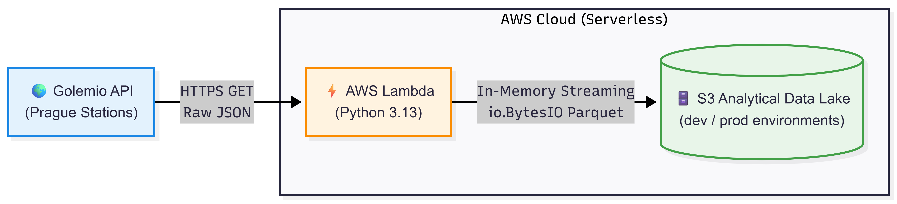
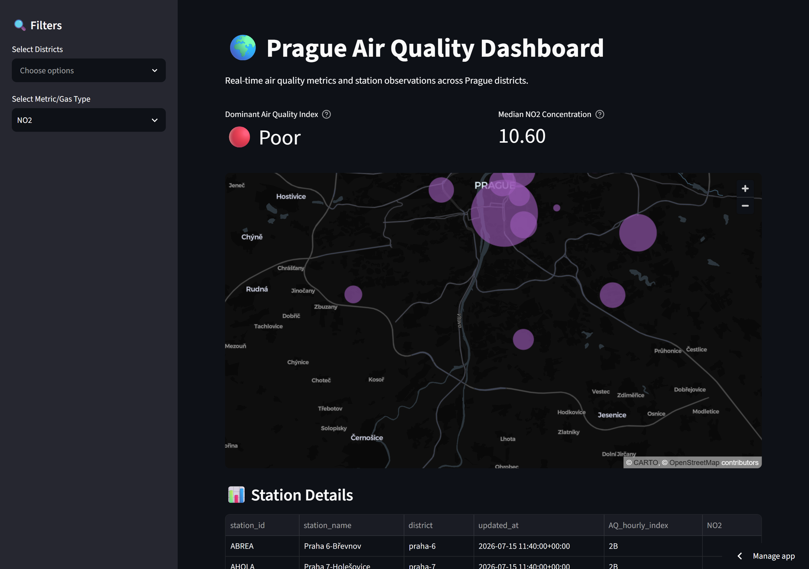

# 🌍 Prague Air Quality ETL Pipeline & Analytics Data Lake

A production-grade, serverless ETL data pipeline that automates the collection, transformation, and warehousing of real-time air quality metrics across Prague stations utilizing the **Golemio API**. 

Built with an emphasis on **clean architecture (Decoupling)**, strict infrastructure-as-code **(Terraform)** segregation, and high-performance data processing **(Polars)**.

---

## 🚀 Key Features & Architectural Highlights

- **Vendor-Agnostic Core:** Decoupled data ingestion logic using structural strategy and dependency injection patterns (`DataWriter`). Seamlessly switches between local filesystem operations and cloud environments without modifications to the business logic.
- **High-Performance Processing:** Built entirely on **Polars**, implementing safe ISO-datetime parsing, memory-efficient flattening of deeply nested GeoJSON payloads, and explicit schema enforcement.
- **Robust Multi-Environment Infrastructure:** Managed via **Terraform** with strict separation between `dev` and `prod` topologies (isolated S3 Data Lakes, unique IAM Role scopes, and CloudWatch trigger crons).
- **Industrial CI/CD & Testing:** Automated GitHub Actions workflow utilizing **GitHub Environments** to securely lock production access to the `main` branch. Integrates complete End-to-End (E2E) testing powered by `pytest` and `moto` (S3 virtual mocking) executing on every pull request.
- **Cloud Native Data Warehousing:** Serverless state ingestion utilizing AWS Lambda and EventBridge Cron scheduling. Data is serialized into compressed **Apache Parquet** tables directly exposed via **AWS Athena** for ad-hoc analytical SQL querying.

---

## 🛠️ Tech Stack & Tooling

- **Language:** Python 3.13
- **Data Engineering:** Polars, Apache Parquet
- **Infrastructure:** Terraform, AWS (Lambda, S3, EventBridge, IAM, Athena)
- **CI/CD & Automation:** GitHub Actions, GitHub Environments
- **Testing & Quality:** Pytest, Moto (AWS Mocking), Httpx, Pip-tools

---

## 📐 Architecture Blueprint



## 💾 Analytical Data Schema (AWS Athena / Parquet)

The structured relational layer flattens historical station measurements into an optimized columnar model:

| Column Name | Type | Description |
| :--- | :--- | :--- |
| **station_id** | `STRING` | Unique identifier of the measurement station (e.g., `ABREA`) |
| **station_name** | `STRING` | Human-readable name (e.g., `Praha 6-Břevnov`) |
| **district** | `STRING` | Prague city district |
| **longitude** | `DOUBLE` | Geospatial coordinate X |
| **latitude** | `DOUBLE` | Geospatial coordinate Y |
| **updated_at** | `TIMESTAMP` | ISO 8601 Timestamp of the measurement |
| **component_type** | `STRING` | Monitored gas/particle type (`NO2`, `PM10`, `PM2.5`) |
| **component_value** | `DOUBLE` | Verified concentration value in µg/m³ |

---

## 💻 Local Development & Testing

This project uses [uv](https://github.com/astral-sh/uv) for fast, reliable Python package and environment management.

### 1. Environment Setup

To clone the repository and initialize your environment with all runtime and development dependencies:

```bash
# Clone the repository
git clone <your-repo-url>
cd air-quality

# Sync dependencies and initialize the virtual environment (.venv)
uv sync --all-groups

# Activate the virtual environment (optional, as `uv run` handles execution)
source .venv/bin/activate
```

### 2. Execution

Run the ETL pipeline locally. Due to strict built-in security controls, a local invocation defaults to writing directly to the disk without impacting the AWS Cloud production topology:

```bash
# Run the pipeline locally
uv run python src/air_quality/main.py
```

### 3. Verification & Testing

Execute the complete test suite including E2E Lambda execution simulations and Golemio payload mutation parsers:

```bash
# Run tests using uv
uv run pytest -o pythonpath=src tests/

# Alternatively, use the Makefile target
make test
```

### 4. Code Quality & Linting

Format and check code style with Ruff:

```bash
# Run Ruff linter
uv run ruff check src/

# Alternatively, use the Makefile target
make lint
```

---

## 📈 Dashboard

[](https://prague-air-quality.streamlit.app/)

[](https://prague-air-quality.streamlit.app/)
